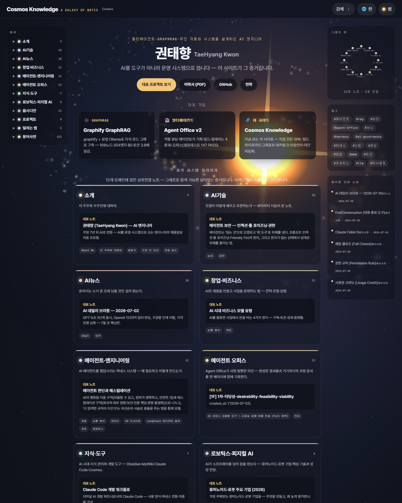

# 🌌 Cosmos Knowledge

> ℹ️ 이 저장소는 **배포 산출물**입니다. 원본 콘텐츠와 빌드 파이프라인(관리자 서버·야간 생성기 포함)은
> 로컬 프라이빗 저장소에서 관리되며, 공개 빌드만 이곳으로 발행됩니다.

**권태향(TaeHyang Kwon) — AI 엔지니어 포트폴리오 + 개인 지식정원**

> **라이브: https://capernaum-user.github.io/cosmos-knowledge/**

멀티에이전트 · GraphRAG · 무인 자동화를 다루는 지식 노트 300여 개를
은하(코스믹) 테마의 자체 제작 SPA로 발행합니다. 매일 새벽에는 사람 개입 없이
AI가 뉴스를 수집·집필하고 용어를 등록하고 팟캐스트를 합성해 이 사이트에 발행합니다.



## 특징

- **순수 정적 SPA** — 런타임 npm 의존성 0. Node 내장 모듈로 빌드하고 브라우저 CDN(marked/mermaid)만 사용
- **위키 엔진** — `[[위키링크]]` · 백링크 · 로컬 그래프 뷰 · 용어 자동 링크 · Mermaid/Excalidraw 렌더
- **한/영 이중언어** — 노트별 영어판 병행
- **무인 야간 파이프라인** — 뉴스 수집 → 브리핑 집필(Claude 헤드리스) → 용어 등록 → 팟캐스트 합성(TTS) → 빌드 → 발행
- **보안 게이트** — 공개 배포 전 PII·기밀 유출 감사를 자동 실행, 실패 시 배포 중단

## 아키텍처

```
옵시디언 위키 원본 (content/**/*.md)
        │  build-content.mjs  (md → 단일 데이터 번들, 공개/내부 이중 빌드)
        ▼
garden-data.js ──▶ SPA (app.js · galaxy-field.js)
        │  deploy.ps1  (유출 감사 → 이 저장소 → GitHub Pages)
        ▼
https://capernaum-user.github.io/cosmos-knowledge/
```

## 만든 사람

**권태향 (TaeHyang Kwon)** — 멀티에이전트 · GraphRAG · 무인 자동화 시스템을 설계하는 AI 엔지니어

- GitHub: [@Capernaum-user](https://github.com/Capernaum-user)
- Email: userkek@gmail.com
- 이력서(PDF): [portfolio.pdf](https://capernaum-user.github.io/cosmos-knowledge/assets/resume/portfolio.pdf)
